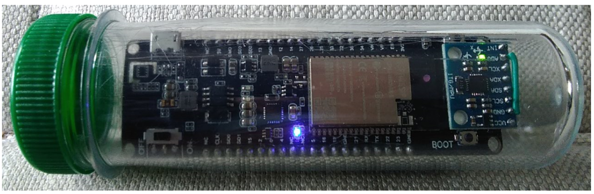
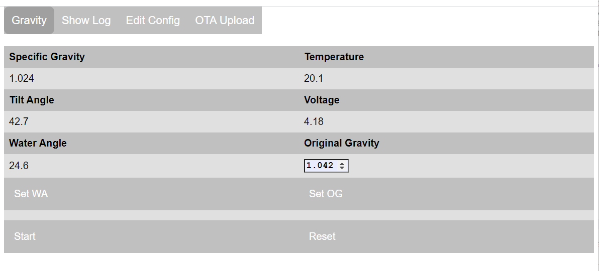

# ESP32_SpecificGravity

Device to calculate Specific Gravity of wort during fermentation from tilt angle of floating sensor, where tilt angle varies with liquid density. 
Designed to provide a qualified rather than precise value for Specific Gravity for simplicity of calibration.

Uses the hardware design approach from http://www.ispindel.de/docs/README_en.html
but simplified to use an ESP32 module with an integral 18650 battery holder and battery management IC TPS5400, and obtain G force readings and temperature from a separate MCU6050 accelerometer on GY-521 module.
The code base has been independently developed.

The generated data is packaged into a json string, this data can be viewed:
* whilst the ESP32 is awake by using its own web server accessed from a browser.
* on a remote host listening receiving json data using a http client. 

On power up, ESP32 will remain awake for calibration purposes (see below) until user presses the __Start__ button on the web page.
The ESP32 will then periodically wakeup to collect data and send this to the remote host, then return to deep sleep.

## Installation

Download github files into the Arduino IDE sketch folder, removing `-main` from the application folder name.

Compile using arduino core v2.x or V3.x (min v3.0.3) and the following Partition scheme:
* ESP32-S3 - `8M with spiffs (...)`
* ESP32 - `Minimal SPIFFS (...)`

On first installation, the application will start in wifi AP mode - connect to SSID: **ESP32_SG_...**, to allow router and password details to be entered via the web page on `192.168.4.1`. The configuration data file (except passwords) is automatically created, and the application web pages automatically downloaded from GitHub to the SD card **/data** folder when an internet connection is available.

Subsequent updates to the application, or to the **/data** folder files, can be made using the **OTA Upload** tab. The **/data** folder can also be reloaded from GitHub using the **Reload /data** button on the **Edit Config** tab, or by using a WebDAV client.

## Setup and Calibration

The ESP32 and GY-521 modules fit snugly into a 33mm width x 120mm height PETling:

To view current data and calibrate device before each use:
* Open App web page to get readings.
* Balance device in PETling so settles at c. 25 deg angle in plain water at 20C, then press __Set WA__ button to set lower range of curve.
* Use hydrometer to measure the original gravity of the wort prior to fermentation.
* Enter hydrometer value into __Original Gravity__ field, e.g. 1.045.
* Place device in wort and wait till angle settles, then press __Set OG__ button to set upper range of curve.
* Press __Start__ button to start monitoring, device will go to sleep
* Press __Reset__ to reenter calibration mode.  
  If the device is in deep sleep, pressing boot button has same effect.

## Configuration

The device can be configured from the web page under __Edit Config__ tab:
* __Wifi__: to change wifi details, in particular IP address of remote client.
* __Sensors__: pin selection etc.
* __Other__: time that device is awake and time that device is asleep (to save battery)
* Press __Save__ button for changes to persist, then __Reboot ESP__ to apply changes

